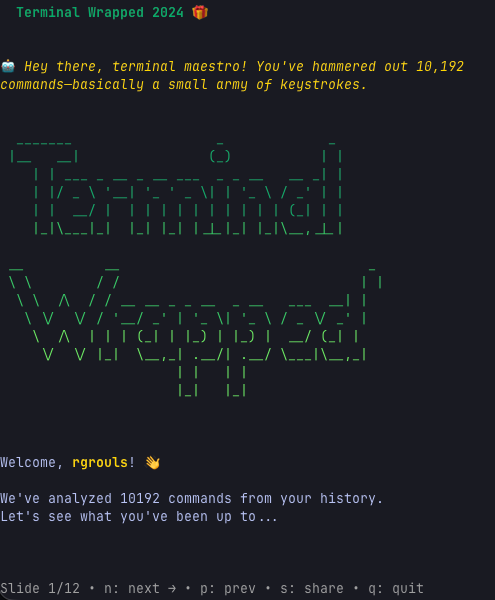

# Terminal Wrapped 🎁

A CLI tool to visualize your terminal usage history, written in Go.



## Installation

### Option 1: Download Pre-built Binary (Recommended)

Download the latest release for your platform from the [Releases](https://github.com/rgrouls/terminal-wrapped/releases) page.

**macOS:**
```bash
# Intel Mac
curl -L -o terminal-wrapped https://github.com/rgrouls/terminal-wrapped/releases/download/v1.0.0/terminal-wrapped-darwin-amd64
chmod +x terminal-wrapped
sudo mv terminal-wrapped /usr/local/bin/

# Apple Silicon (M1/M2/M3)
curl -L -o terminal-wrapped https://github.com/rgrouls/terminal-wrapped/releases/download/v1.0.0/terminal-wrapped-darwin-arm64
chmod +x terminal-wrapped
sudo mv terminal-wrapped /usr/local/bin/
```

**Linux:**
```bash
# x86_64
curl -L -o terminal-wrapped https://github.com/rgrouls/terminal-wrapped/releases/download/v1.0.0/terminal-wrapped-linux-amd64
chmod +x terminal-wrapped
sudo mv terminal-wrapped /usr/local/bin/

# ARM64
curl -L -o terminal-wrapped https://github.com/rgrouls/terminal-wrapped/releases/download/v1.0.0/terminal-wrapped-linux-arm64
chmod +x terminal-wrapped
sudo mv terminal-wrapped /usr/local/bin/
```

**Windows:**
Download `terminal-wrapped-windows-amd64.exe` or `terminal-wrapped-windows-arm64.exe` from the releases page.

### Option 2: Install with Go

Requires Go 1.25 or later:

```bash
go install github.com/rgrouls/terminal-wrapped/cmd/terminal-wrapped@latest
```

### Option 3: Build from Source

```bash
git clone https://github.com/rgrouls/terminal-wrapped.git
cd terminal-wrapped
make build
# Binary will be in dist/terminal-wrapped
```

## Usage

Run the tool:

```bash
terminal-wrapped
```

Navigate through the TUI to view your terminal statistics, top commands, activity heatmaps, and more.

## Features

- 📊 **Interactive TUI**: Built with Bubble Tea for a smooth, responsive experience
- 📈 **Detailed Stats**: Analyze your top commands, daily activity patterns, and usage trends
- 🗓️ **Activity Heatmap**: Visualize when you're most active in the terminal
- 🤖 **AI Roasts**: Get a witty roast of your terminal habits (powered by Nebius AI, optional)
- 🐳 **Self-Hosted Proxy**: Securely host the AI proxy on your own infrastructure

## AI Features (Optional)

To enable AI-powered roasts, you need to run the proxy service with a Nebius AI API key.

### Running the Proxy Locally

```bash
cd proxy
export NEBIUS_API_KEY="your-nebius-api-key"
go run main.go
```

Or using Docker Compose:

```bash
cd proxy
# Edit .env file with your NEBIUS_API_KEY
docker-compose up
```

The proxy will run on `http://localhost:8080` by default.

### Deploying the Proxy to a Remote Server

If you want to host the AI proxy on a remote server:

1. **Configure**: Edit `proxy/.env` with your Nebius API key and `deploy.sh` with your server details
2. **Deploy**:
   ```bash
   ./deploy.sh
   ```
3. **Verify**:
   ```bash
   curl http://<your-server-ip>:8080/health
   ```

### Configure the App to Use Your Proxy

By default, the app connects to `http://localhost:8080/roast`. To use a remote proxy, set the `TERMINAL_WRAPPED_PROXY` environment variable:

```bash
export TERMINAL_WRAPPED_PROXY="http://your-server-ip:8080/roast"
terminal-wrapped
```

## Development

### Building for All Platforms

```bash
make build-all
```

This creates binaries for:
- macOS (Intel & Apple Silicon)
- Linux (x86_64 & ARM64)
- Windows (x86_64 & ARM64)

### Other Make Commands

```bash
make help     # Show all available commands
make test     # Run tests
make clean    # Remove build artifacts
make deps     # Download dependencies
make run      # Run the application
```

## License

MIT License - see LICENSE file for details

## Contributing

Contributions are welcome! Please feel free to submit a Pull Request.
